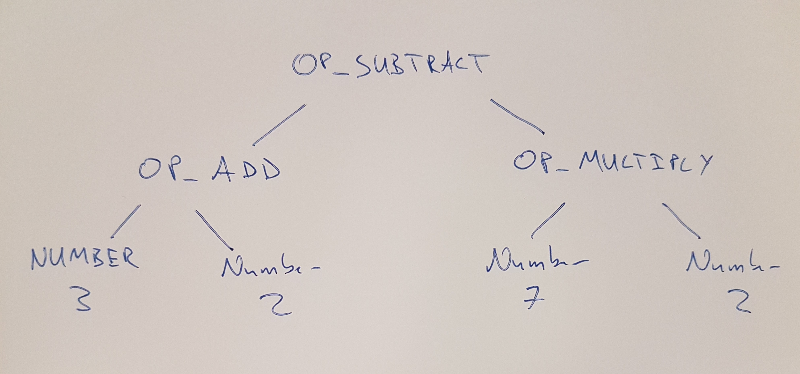

This is a tutorial style post that walks through using the RPython translation
toolchain to create a simple REPL that executes basic math expressions. By the
end we will be scanning the user's input into tokens, compiling those tokens into
bytecode and running that bytecode in our own virtual machine.

This post is a bit of a diversion while on my journey to create a compliant 
[lox](http://www.craftinginterpreters.com/the-lox-language.html) implementation
using the [RPython translation toolchain](https://rpython.readthedocs.io). The 
majority of this work is a direct RPython translation of the low level C 
guide from Bob Nystrom ([@munificentbob](https://twitter.com/munificentbob)) in the
excellent book [craftinginterpreters.com](https://www.craftinginterpreters.com)
in chapters 14 – 17.


## The road ahead

As this post is rather long I'll break it into a few major sections. In each section we will
have something that translates with RPython, and at the end it all comes together. 

- [REPL](#a-repl)
- [Virtual Machine](#a-virtual-machine)
- [Scanning the source](#scanning-the-source)
- [Compiling Expressions](#compiling-expressions)
- [End to end](#end-to-end)
- [Bonus - JIT](#jit-the-vm)


## A REPL

So if you're a Python programmer you might be thinking this is pretty trivial right?

I mean if we ignore input errors, injection attacks etc couldn't we just do something
like this:

```python
"""
A pure python REPL that can parse simple math expressions
"""
while True:
    print(eval(raw_input("> ")))
```

Well it does appear to do the trick:
```
$ python2 section-1-repl/main.py
> 3 + 4 * ((1.0/(2 * 3 * 4)) + (1.0/(4 * 5 * 6)) - (1.0/(6 * 7 * 8)))
3.1880952381
```

So can we just ask RPython to translate this into a binary that runs magically
faster?

Let's see what happens. We need to add two functions for RPython to
get its bearings (`entry_point` and `target`) and call the file `targetXXX`:

[`targetrepl1.py`](section-1-repl/targetrepl1.py)

```python
def repl():
    while True:
        print eval(raw_input('> '))


def entry_point(argv):
    repl()
    return 0


def target(driver, *args):
    return entry_point, None
```

Which at translation time gives us this admonishment that accurately tells us
we are trying to call a Python built-in `raw_input` that is unfortunately not 
valid RPython.

```
$ rpython ./1/targetrepl1.py
...SNIP...
[translation:ERROR] AnnotatorError: 

object with a __call__ is not RPython: <built-in function raw_input>
Processing block:
 block@18 is a <class 'rpython.flowspace.flowcontext.SpamBlock'> 
 in (target1:2)repl 
 containing the following operations: 
       v0 = simple_call((builtin_function raw_input), ('> ')) 
       v1 = simple_call((builtin_function eval), v0) 
       v2 = str(v1) 
       v3 = simple_call((function rpython_print_item), v2) 
       v4 = simple_call((function rpython_print_newline)) 

```

Ok so we can't use `raw_input` or `eval` but that doesn't faze us. Let's get 
the input from a stdin stream and just print it out (no evaluation).
 

[`targetrepl2.py`](section-1-repl/targetrepl2.py)
```python
from rpython.rlib import rfile

LINE_BUFFER_LENGTH = 1024


def repl(stdin):
    while True:
        print "> ",
        line = stdin.readline(LINE_BUFFER_LENGTH)
        print line


def entry_point(argv):
    stdin, stdout, stderr = rfile.create_stdio()
    try:
        repl(stdin)
    except:
        return 0


def target(driver, *args):
    return entry_point, None

```

Translate `targetrepl2.py` – we can add an optimization level if we
are so inclined:

```
$ rpython --opt=2 section-1-repl/targetrepl2.py
...SNIP...
[Timer] Timings:
[Timer] annotate                       ---  1.2 s
[Timer] rtype_lltype                   ---  0.9 s
[Timer] backendopt_lltype              ---  0.6 s
[Timer] stackcheckinsertion_lltype     ---  0.0 s
[Timer] database_c                     --- 15.0 s
[Timer] source_c                       ---  1.6 s
[Timer] compile_c                      ---  1.9 s
[Timer] =========================================
[Timer] Total:                         --- 21.2 s
```

No errors!? Let's try it out:
```
$ ./target2-c 
1 + 2
>  1 + 2

^C
```

Ahh our first success – let's quickly deal with the flushing fail by using the 
stdout stream directly as well. Let's print out the input in quotes:

```python
from rpython.rlib import rfile

LINE_BUFFER_LENGTH = 1024


def repl(stdin, stdout):
    while True:
        stdout.write("> ")
        line = stdin.readline(LINE_BUFFER_LENGTH)
        print '"%s"' % line.strip()


def entry_point(argv):
    stdin, stdout, stderr = rfile.create_stdio()
    try:
        repl(stdin, stdout)
    except:
        pass
    return 0


def target(driver, *args):
    return entry_point, None
```

Translation works, and the test run too:

```
$ ./target3-c 
> hello this seems better
"hello this seems better"
> ^C
```

So we are in a good place with taking user input and printing output... What about
the whole math evaluation thing we were promised? For that we are can probably leave
our RPython REPL behind for a while and connect it up at the end.

## A virtual machine

A virtual machine is the execution engine of our basic math interpreter. It will be very simple,
only able to do simple tasks like addition. I won't go into any depth to describe why we want
a virtual machine, but it is worth noting that many languages including Java and Python make 
this decision to compile to an intermediate bytecode representation and then execute that with
a virtual machine. Alternatives are compiling directly to native machine code like (earlier versions of) the V8
JavaScript engine, or at the other end of the spectrum executing an abstract syntax tree – 
which is what the [Truffle approach to building VMs](https://blog.plan99.net/graal-truffle-134d8f28fb69) is based on. 

We are going to keep things very simple. We will have a stack where we can push and pop values,
we will only support floats, and our VM will only implement a few very basic operations.

### OpCodes

In fact our entire instruction set is:

    OP_CONSTANT
    OP_RETURN
    OP_NEGATE
    OP_ADD
    OP_SUBTRACT
    OP_MULTIPLY
    OP_DIVIDE

Since we are targeting RPython we can't use the nice `enum` module from the Python standard
library, so instead we just define a simple class with class attributes.
 
We should start to get organized, so we will create a new file 
[`opcodes.py`](section-2-vm/opcodes.py) and add this:

```python
class OpCode:
    OP_CONSTANT = 0
    OP_RETURN = 1
    OP_NEGATE = 2
    OP_ADD = 3
    OP_SUBTRACT = 4
    OP_MULTIPLY = 5
    OP_DIVIDE = 6
```

### Chunks

To start with we need to get some infrastructure in place before we write the VM engine.

Following [craftinginterpreters.com](https://www.craftinginterpreters.com/chunks-of-bytecode.html)
we start with a `Chunk` object which will represent our bytecode. In RPython we have access 
to Python-esq lists so our `code` object will just be a list of `OpCode` values – which are 
just integers. A list of ints, couldn't get much simpler.

`section-2-vm/chunk.py`
```python
class Chunk:
    code = None

    def __init__(self):
        self.code = []

    def write_chunk(self, byte):
        self.code.append(byte)

    def disassemble(self, name):
        print "== %s ==\n" % name
        i = 0
        while i < len(self.code):
            i = disassemble_instruction(self, i)
```

_From here on I'll only present minimal snippets of code instead of the whole lot, but 
I'll link to the repository with the complete example code. For example the 
various debugging including `disassemble_instruction` isn't particularly interesting
to include verbatim. See the [github repo](https://github.com/hardbyte/pylox/) for full details_


We need to check that we can create a chunk and disassemble it. The quickest way to do this
is to use Python during development and debugging then every so often try to translate it.

Getting the disassemble part through the RPython translator was a hurdle for me as I
quickly found that many `str` methods such as `format` are not supported, and only very basic
`%` based formatting is supported. I ended up creating helper functions for string manipulation
such as:

```python
def leftpad_string(string, width, char=" "):
    l = len(string)
    if l > width:
        return string
    return char * (width - l) + string
```

Let's write a new `entry_point` that creates and disassembles a chunk of bytecode. We can
set the target output name to `vm1` at the same time:

[`targetvm1.py`](section-2-vm/targetvm1.py)
```python
def entry_point(argv):
    bytecode = Chunk()
    bytecode.write_chunk(OpCode.OP_ADD)
    bytecode.write_chunk(OpCode.OP_RETURN)
    bytecode.disassemble("hello world")
    return 0

def target(driver, *args):
    driver.exe_name = "vm1"
    return entry_point, None
```

Running this isn't going to be terribly interesting, but it is always nice to
know that it is doing what you expect:

```
$ ./vm1 
== hello world ==

0000 OP_ADD       
0001 OP_RETURN    
```


### Chunks of data

Ref: http://www.craftinginterpreters.com/chunks-of-bytecode.html#constants

So our bytecode is missing a very crucial element – the values to operate on!

As with the bytecode we can store these constant values as part of the chunk
directly in a list. Each chunk will therefore have a constant data component,
and a code component. 

Edit the `chunk.py` file and add the new instance attribute `constants` as an
empty list, and a new method `add_constant`.

```python
    def add_constant(self, value):
        # See if we already know this constant
        for i, constant in enumerate(self.constants):
            if constant == value:
                return i
        self.constants.append(value)
        return len(self.constants) - 1

```

<!---
cfbolz: aside: this is quadratic in the number of unique constants, you could
use a dict instead. Probably doesn't matter in practice of course!
-->

Now to use this new capability we can modify our example chunk
to write in some constants before the `OP_ADD`:

```python
    bytecode = Chunk()
    constant = bytecode.add_constant(1)
    bytecode.write_chunk(OpCode.OP_CONSTANT)
    bytecode.write_chunk(constant)

    constant = bytecode.add_constant(2)
    bytecode.write_chunk(OpCode.OP_CONSTANT)
    bytecode.write_chunk(constant)

    bytecode.write_chunk(OpCode.OP_ADD)
    bytecode.write_chunk(OpCode.OP_RETURN)

    bytecode.disassemble("adding constants")
```


<!---
cfbolz: shouldn't this be ".add_constant(1.0)" since it is all based on floats?
-->

Which still translates with RPython and when run gives us the following disassembled
bytecode:

```$ ./vm2
== adding constants ==

0000 OP_CONSTANT  (00)        '1'
0002 OP_CONSTANT  (01)        '2'
0004 OP_ADD       
0005 OP_RETURN
```

We won't go down the route of serializing the bytecode to disk, but this bytecode chunk
(including the constant data) could be saved and executed on our VM later – like a Java
`.class` file. Instead we will pass the bytecode directly to our VM after we've created
it during the compilation process. 

### Emulation  

So those four instructions of bytecode combined with the constant value mapping
`00 -> 1.0` and `01 -> 2.0` describes individual steps for our virtual machine
to execute. One major point in favor of defining our own bytecode is we can 
design it to be really simple to execute – this makes the VM really easy to implement.

As I mentioned earlier this virtual machine will have a stack, so let's begin with that.
Now the stack is going to be a busy little beast – as our VM takes instructions like 
`OP_ADD` it will pop off the top two values from the stack, and push the result of adding 
them together back onto the stack. Although dynamically resizing Python lists 
are marvelous, they can be a little slow. (I'm not sure if RPython actually needs this
hint?)
<!---
cfbolz: RPython does, actually! gives much better results because it means a
lot more of the list manipulation will be removed.
-->

So for (premature) performance optimization reasons we will define a constant sized list
and track the `stack_top` directly. Note how I'm trying to give the RPython translator hints
by adding assertions about the state that I promise the `stack_top` will be in.
 

```python
class VM(object):
    STACK_MAX_SIZE = 256
    stack = None
    stack_top = 0

    def __init__(self):
        self._reset_stack()

    def _reset_stack(self):
        self.stack = [0] * self.STACK_MAX_SIZE
        self.stack_top = 0

    def _stack_push(self, value):
        assert self.stack_top < self.STACK_MAX_SIZE
        self.stack[self.stack_top] = value
        self.stack_top += 1

    def _stack_pop(self):
        assert self.stack_top >= 0
        self.stack_top -= 1
        return self.stack[self.stack_top]

    def _print_stack(self):
        print "         ",
        if self.stack_top <= 0:
            print "[]",
        else:
            for i in range(self.stack_top):
                print "[ %s ]" % self.stack[i],
        print

```

Now we get to the main event, the hot loop, the VM engine. Hope I haven't built it up to much, it is 
actually really simple! We loop until the instructions tell us to stop (`OP_RETURN`),
and dispatch to other simple methods based on the instruction.

```python
    def _run(self):
        while True:
            instruction = self._read_byte()

            if instruction == OpCode.OP_RETURN:
                print "%s" % self._stack_pop()
                return IntepretResultCode.INTERPRET_OK
            elif instruction == OpCode.OP_CONSTANT:
                constant = self._read_constant()
                self._stack_push(constant)
            elif instruction == OpCode.OP_ADD:
                self._binary_op(self._stack_add)    
```

<!---
cfbolz: typo in the code: "InterpretResultCode (missing r).
-->

Now the `_read_byte` method will have to keep track of which instruction we are up 
to. So add an instruction pointer (`ip`) to the VM with an initial value of `0`.
Then `_read_byte` is simply getting the next bytecode (int) from the chunk's `code`:

```python
    def _read_byte(self):
        instruction = self.chunk.code[self.ip]
        self.ip += 1
        return instruction
``` 

If the instruction is `OP_CONSTANT` we take the constant's address from the next byte
of the chunk's `code`, retrieve that constant value and add it to the VM's stack.

```python
    def _read_constant(self):
        constant_index = self._read_byte()
        return self.chunk.constants[constant_index]
```

Finally our first arithmetic operation `OP_ADD`, what it has to achieve doesn't 
require much explanation: pop two values from the stack, add them together, push the result.
But since a few operations all have the same template we introduce a layer of indirection – 
or abstraction – by introducing a reusable `_binary_op` helper method.

```python
    def _binary_op(self, operator):
        op2 = self._stack_pop()
        op1 = self._stack_pop()
        result = operator(op1, op2)
        self._stack_push(result)

    @staticmethod
    def _stack_add(op1, op2):
        return op1 + op2

``` 

<!---
cfbolz: comment about the code: you can tell RPython to specialize _binary_op
on the first argument like this:

from rpython.rlib.objectmodel import specialize

...

    @specialize.arg(1)
    def _binary_op(self, operator):
        ...

This will cause RPython to make a copy of _binary_op for every value of the
first argument passed, which means that the copy contains a call to a constant
operator, which can then be inlined.

In your current version your generated C code would still contain a call to a
function pointer.
-->

To run our example bytecode the only thing left to do is to pass in the
chunk and call `_run()`:

```python
    def interpret_chunk(self, chunk):
        if self.debug_trace:
            print "== VM TRACE =="
        self.chunk = chunk
        self.ip = 0
        try:
            result = self._run()
            return result
        except:
            return IntepretResultCode.INTERPRET_RUNTIME_ERROR
```

`targetvm3.py` connects the pieces:

```python
def entry_point(argv):
    bytecode = Chunk()
    constant = bytecode.add_constant(1)
    bytecode.write_chunk(OpCode.OP_CONSTANT)
    bytecode.write_chunk(constant)
    constant = bytecode.add_constant(2)
    bytecode.write_chunk(OpCode.OP_CONSTANT)
    bytecode.write_chunk(constant)
    bytecode.write_chunk(OpCode.OP_ADD)
    bytecode.write_chunk(OpCode.OP_RETURN)

    vm = VM()
    vm.interpret_chunk(bytecode)

    return 0
```

I've added some trace debugging so we can see what the VM and stack is doing.

The whole thing translates with RPython, and when run gives us:

```
./vm3
== VM TRACE ==
          []
0000 OP_CONSTANT  (00)        '1'
          [ 1 ]
0002 OP_CONSTANT  (01)        '2'
          [ 1 ] [ 2 ]
0004 OP_ADD       
          [ 3 ]
0005 OP_RETURN    
3
```

Yes we just computed the result of `1+2`. Pat yourself on the back. 

At this point it is probably valid to check that the translated executable is actually
faster than running our program directly in Python. For this trivial example under 
`Python2`/`pypy` this `targetvm3.py` file runs in 20ms – 90ms region, and the compiled
`vm3` runs in <5ms. Something useful must be happening during the translation.

<!---
cfbolz: I bet that the main difference is that vm3 starts up *much* quicker
than python and pypy ;-)
-->

I won't go through the code adding support for our other instructions as they are
very similar and straightforward. Our VM is ready to execute our chunks of bytecode,
but we haven't yet worked out how to take the entered expression and turn that into
this simple bytecode. This is broken into two steps, scanning and compiling.

## Scanning the source

_All the source for this section can be found in 
[section-3-scanning](section-3-scanning)._

The job of the scanner is to take the raw expression string and transform it into
a sequence of tokens. This scanning step will strip out whitespace and comments, 
catch errors with invalid token and tokenize the string. For example the input 
`"( 1 + 2 )` would get tokenized into `LEFT_PAREN, NUMBER(1), PLUS, NUMBER(2), RIGHT_PAREN`.

As with our `OpCodes` we will just define a simple Python class to define an `int`
for each type of token:

```python
class TokenTypes:
    ERROR = 0
    EOF = 1
    LEFT_PAREN = 2
    RIGHT_PAREN = 3
    MINUS = 4
    PLUS = 5
    SLASH = 6
    STAR = 7
    NUMBER = 8

```

A token has to keep some other information as well – keeping track of the `location` and 
`length` of the token will be helpful for error reporting. The NUMBER Token clearly needs 
some data about the value it is representing: we could include a copy of the source lexeme 
(e.g. the string `2.0`), or parse the value and store that, or – what we will do in this 
blog – use the `location` and `length` information as pointers into the original source 
string. Every token type (except perhaps `ERROR`) will use this simple data structure: 

```python
class Token(object):

    def __init__(self, start, length, token_type):
        self.start = start
        self.length = length
        self.type = token_type
```

Our soon to be scanner will create these `Token` objects which refer back to addresses
in some source. If the scanner sees the source `"( 1 + 2.0 )"` it would emit the following
tokens:

```python
Token(0, 1, TokenTypes.LEFT_PAREN)
Token(2, 1, TokenTypes.NUMBER)
Token(4, 1, TokenTypes.PLUS)
Token(6, 3, TokenTypes.NUMBER)
Token(10, 1, TokenTypes.RIGHT_PAREN)
```

### Scanner

Let's walk through the scanner [implementation](section-3-scanning/scanner.py) method
by method. The scanner will take the source and pass through it once, creating tokens
as it goes.

```python
class Scanner(object):

    def __init__(self, source):
        self.source = source
        self.start = 0
        self.current = 0
```

The `start` and `current` variables are character indices in the source string that point to 
the current substring being considered as a token. 

For example in the string `"(51.05+2)"` while we are tokenizing the number `51.05`
we will have `start` pointing at the `5`, and advance `current` character by character
until the character is no longer part of a number. Midway through scanning the number 
the `start` and `current` values might point to `1` and `4` respectively:


| 0 | 1 | 2 | 3 | 4 | 5 | 6 | 7 | 8 | 
|---|---|---|---|---|---|---|---|---|
|"("|"5"|"1"|"."|"0"|"5"|"+"|"2"|")"| 
|   | ^ |   |   | ^ |   |   |   |   |

From `current=4` the scanner peeks ahead and sees that the next character (`5`) is
a digit, so will continue to advance.

| 0 | 1 | 2 | 3 | 4 | 5 | 6 | 7 | 8 | 
|---|---|---|---|---|---|---|---|---|
|"("|"5"|"1"|"."|"0"|"5"|"+"|"2"|")"| 
|   | ^ |   |   |   | ^ |   |   |   |

When the scanner peeks ahead and sees the `"+"` it will create the number
token and emit it. The method that carry's out this tokenizing is `_number`:

```python
    def _number(self):
        while self._peek().isdigit():
            self.advance()

        # Look for decimal point
        if self._peek() == '.' and self._peek_next().isdigit():
            self.advance()
            while self._peek().isdigit():
                self.advance()

        return self._make_token(TokenTypes.NUMBER)
```

It relies on a few helpers to look ahead at the upcoming characters:

```python
    def _peek(self):
        if self._is_at_end():
            return '\0'
        return self.source[self.current]

    def _peek_next(self):
        if self._is_at_end():
            return '\0'
        return self.source[self.current+1]

    def _is_at_end(self):
        return len(self.source) == self.current
```

If the character at `current` is still part of the number we want to call `advance`
to move on by one character.

```python
    def advance(self):
        self.current += 1
        return self.source[self.current - 1]
```

Once the `isdigit()` check fails in `_number()` we call `_make_token()` to emit the
token with the `NUMBER` type.

```python
    def _make_token(self, token_type):
        return Token(
            start=self.start,
            length=(self.current - self.start),
            token_type=token_type
        )
```

Note again that the token is linked to an index address in the source, rather than 
including the string value.

Our scanner is pull based, a token will be requested via `scan_token`. First we skip 
past whitespace and depending on the characters emit the correct token:

```python
    def scan_token(self):
        # skip any whitespace
        while True:
            char = self._peek()
            if char in ' \r\t\n':
                self.advance()
            break
        
        self.start = self.current

        if self._is_at_end():
            return self._make_token(TokenTypes.EOF)

        char = self.advance()

        if char.isdigit():
            return self._number()

        if char == '(':
            return self._make_token(TokenTypes.LEFT_PAREN)
        if char == ')':
            return self._make_token(TokenTypes.RIGHT_PAREN)
        if char == '-':
            return self._make_token(TokenTypes.MINUS)
        if char == '+':
            return self._make_token(TokenTypes.PLUS)
        if char == '/':
            return self._make_token(TokenTypes.SLASH)
        if char == '*':
            return self._make_token(TokenTypes.STAR)

        return ErrorToken("Unexpected character", self.current)
``` 

If this was a real programming language we were scanning, this would be the point where we 
add support for different types of literals and any language identifiers/reserved words.

At some point we will need to parse the literal value for our numbers, but we leave that
job for some later component, for now we'll just add a `get_token_string` helper. To make
sure that RPython is happy to index arbitrary slices of `source` we add range assertions:

```python
    def get_token_string(self, token):
        if isinstance(token, ErrorToken):
            return token.message
        else:
            end_loc = token.start + token.length
            assert end_loc < len(self.source)
            assert end_loc > 0
            return self.source[token.start:end_loc]

```

A simple entry point can be used to test our scanner with a hard coded 
source string:

[`targetscanner1.py`](./section-3-scanning/targetscanner1.py)
```python
from scanner import Scanner, TokenTypes, TokenTypeToName


def entry_point(argv):

    source = "(   1   + 2.0 )"

    scanner = Scanner(source)
    t = scanner.scan_token()
    while t.type != TokenTypes.EOF and t.type != TokenTypes.ERROR:
        print TokenTypeToName[t.type],
        if t.type == TokenTypes.NUMBER:
            print "(%s)" % scanner.get_token_string(t),
        print
        t = scanner.scan_token()
    return 0
```

RPython didn't complain, and lo it works:
```
$ ./scanner1 
LEFT_PAREN
NUMBER (1)
PLUS
NUMBER (2.0)
RIGHT_PAREN
```

Let's connect our REPL to the scanner.

[`targetscanner2.py`](./section-3-scanning/targetscanner2.py)
```python
from rpython.rlib import rfile
from scanner import Scanner, TokenTypes, TokenTypeToName

LINE_BUFFER_LENGTH = 1024


def repl(stdin, stdout):
    while True:
        stdout.write("> ")
        source = stdin.readline(LINE_BUFFER_LENGTH)

        scanner = Scanner(source)
        t = scanner.scan_token()
        while t.type != TokenTypes.EOF and t.type != TokenTypes.ERROR:
            print TokenTypeToName[t.type],
            if t.type == TokenTypes.NUMBER:
                print "(%s)" % scanner.get_token_string(t),
            print
            t = scanner.scan_token()


def entry_point(argv):
    stdin, stdout, stderr = rfile.create_stdio()
    try:
        repl(stdin, stdout)
    except:
        pass
    return 0

```

With our REPL hooked up we can now scan tokens from arbitrary input:

```
$ ./scanner2
> (3 *4) - -3
LEFT_PAREN
NUMBER (3)
STAR
NUMBER (4)
RIGHT_PAREN
MINUS
MINUS
NUMBER (3)
> ^C
```

## Compiling expressions

### References

- https://www.craftinginterpreters.com/compiling-expressions.html
- http://effbot.org/zone/simple-top-down-parsing.htm

The final piece is to turn this sequence of tokens into our low level 
bytecode instructions for the virtual machine to execute. Buckle up, 
we are about to write us a compiler.

Our compiler will take a single pass over the tokens using 
[Vaughan Pratt’s](https://en.wikipedia.org/wiki/Vaughan_Pratt) 
parsing technique, and output a chunk of bytecode – if we do it
right it will be compatible with our existing virtual machine.

Remember the bytecode we defined above is really simple – by relying 
on our stack we can transform a nested expression into a sequence of
our bytecode operations.

To make this more concrete let's go through by hand translating an
expression into bytecode.

Our source expression:
```
(3 + 2) - (7 * 2)
```
 
If we were to make an abstract syntax tree we'd get something 
like this:



Now if we start at the first sub expression `(3+2)` we can clearly
note from the first open bracket that we *must* see a close bracket,
and that the expression inside that bracket *must* be valid on its 
own. Not only that but regardless of the inside we know that the whole
expression still has to be valid. Let's focus on this first bracketed
expression, let our attention recurse into it so to speak.

This gives us a much easier problem – we just want to get our virtual
machine to compute `3 + 2`. In this bytecode dialect we would load the 
two constants, and then add them with `OP_ADD` like so:  

```
OP_CONSTANT  (00) '3.000000'
OP_CONSTANT  (01) '2.000000'
OP_ADD
```

The effect of our vm executing these three instructions is that sitting
pretty at the top of the stack is the result of the addition. Winning.

Jumping back out from our bracketed expression, our next token is `MINUS`,
at this point we have a fair idea that it must be used in an infix position. 
In fact whatever token followed the bracketed expression it **must** be a 
valid infix operator, if not the expression is over or had a syntax error. 

Assuming the best from our user (naive), we handle `MINUS` the same way
we handled the first `PLUS`. We've already got the first operand on the
stack, now we compile the right operand and then write out the bytecode
for `OP_SUBTRACT`.

The right operand is another simple three instructions:

```
OP_CONSTANT  (02) '7.000000'
OP_CONSTANT  (03) '2.000000'
OP_MULTIPLY
```

Then we finish our top level binary expression and write a `OP_RETURN` to
return the value at the top of the stack as the execution's result. Our
final hand compiled program is:

    
```
OP_CONSTANT  (00) '3.000000'
OP_CONSTANT  (01) '2.000000'
OP_ADD
OP_CONSTANT  (02) '7.000000'
OP_CONSTANT  (03) '2.000000'
OP_MULTIPLY
OP_SUBTRACT
OP_RETURN
```

Ok that wasn't so hard was it? Let's try make our code do that.

We define a parser object which will keep track of where we are, and
whether things have all gone horribly wrong:

```python
class Parser(object):
    def __init__(self):
        self.had_error = False
        self.panic_mode = False
        self.current = None
        self.previous = None
```

The compiler will also be a class, we'll need one of our `Scanner` instances
to pull tokens from, and since the output is a bytecode `Chunk` let's go ahead and make 
one of those in our compiler initializer:

```python
class Compiler(object):

    def __init__(self, source):
        self.parser = Parser()
        self.scanner = Scanner(source)
        self.chunk = Chunk()
```

Since we have this (empty) chunk of bytecode we will make a helper method
to add individual bytes. Every instruction will pass through this gate from
our compiler out into the wild as an executable program.

```python
    def emit_byte(self, byte):
        self.current_chunk().write_chunk(byte)
```

To quote from Bob Nystrom on the Pratt parsing technique:

> the implementation is a deceptively-simple handful of deeply intertwined code

I don't actually think I can do justice to this section. Instead I suggest 
reading his treatment in 
[Pratt Parsers: Expression Parsing Made Easy](http://journal.stuffwithstuff.com/2011/03/19/pratt-parsers-expression-parsing-made-easy/)
which explains the magic behind the parsing component. Our only major difference is 
instead of creating an AST we are going to directly emit bytecode for our VM.

Now that I've absolved myself from taking responsibility in explaining this somewhat
tricky concept, I'll discuss some of the code from 
[`compiler.py`](section-4-compiler/compiler.py), and walk through what happens 
for a particular rule.

I'll jump straight to the juicy bit the table of parse rules. We define a `ParseRule`
for each token, and each rule comprises:
- an optional handler for when the token is as a _prefix_ (e.g. the minus in `(-2)`),
- an optional handler for whet the token is used _infix_ (e.g. the slash in `2/47`)
- a precedence value (a number that determines what is of higher precedence)


```python
rules = [
    ParseRule(None,              None,            Precedence.NONE),   # ERROR
    ParseRule(None,              None,            Precedence.NONE),   # EOF
    ParseRule(Compiler.grouping, None,            Precedence.CALL),   # LEFT_PAREN
    ParseRule(None,              None,            Precedence.NONE),   # RIGHT_PAREN
    ParseRule(Compiler.unary,    Compiler.binary, Precedence.TERM),   # MINUS
    ParseRule(None,              Compiler.binary, Precedence.TERM),   # PLUS
    ParseRule(None,              Compiler.binary, Precedence.FACTOR), # SLASH
    ParseRule(None,              Compiler.binary, Precedence.FACTOR), # STAR
    ParseRule(Compiler.number,   None,            Precedence.NONE),   # NUMBER
]
```

These rules really are the magic of our compiler. When we get to a particular
token such as `MINUS` we see if it is an infix operator and if so we've gone and
got its first operand ready. At all times we rely on the relative precedence; consuming 
everything with higher precedence than the operator we are currently evaluating.

In the expression:
```
2 + 3 * 4
```

The `*` has higher precedence than the `+`, so `3 * 4` will be parsed together
as the second operand to the first infix operator (the `+`) which follows
the [BEDMAS](https://en.wikipedia.org/wiki/Order_of_operations#Mnemonics) 
order of operations I was taught at high school.

To encode these precedence values we make another Python object moonlighting
as an enum:

```python
class Precedence(object):
    NONE = 0
    DEFAULT = 1
    TERM = 6        # + -
    FACTOR = 7      # * /
    UNARY = 8       # ! - +
    CALL = 9        # ()
    PRIMARY = 10
```

What happens in our compiler when turning `-2.0` into bytecode? Assume we've just 
pulled the token `MINUS` from the scanner. Every expression **has** to start with some
type of prefix – whether that is:
- a bracket group `(`, 
- a number `2`, 
- or a prefix unary operator `-`. 

Knowing that, our compiler assumes there is a `prefix` handler in the rule table – in
this case it points us at the `unary` handler.

```python
    def parse_precedence(self, precedence):
        # parses any expression of a given precedence level or higher
        self.advance()
        prefix_rule = self._get_rule(self.parser.previous.type).prefix
        prefix_rule(self)
``` 

`unary` is called:

```python
    def unary(self):
        op_type = self.parser.previous.type
        # Compile the operand
        self.parse_precedence(Precedence.UNARY)
        # Emit the operator instruction
        if op_type == TokenTypes.MINUS:
            self.emit_byte(OpCode.OP_NEGATE)
```

Here – before writing the `OP_NEGATE` opcode we recurse back into `parse_precedence`
to ensure that _whatever_ follows the `MINUS` token is compiled – provided it has 
higher precedence than `unary` – e.g. a bracketed group. 
Crucially at run time this recursive call will ensure that the result is left 
on top of our stack. Armed with this knowledge, the `unary` method just
has to emit a single byte with the `OP_NEGATE` opcode.


### Test compilation

Now we can test our compiler by outputting disassembled bytecode
of our user entered expressions. Create a new entry_point 
[`targetcompiler`](section-4-compiler/targetcompiler1.py):
 
```python
from rpython.rlib import rfile
from compiler import Compiler

LINE_BUFFER_LENGTH = 1024


def entry_point(argv):
    stdin, stdout, stderr = rfile.create_stdio()

    try:
        while True:
            stdout.write("> ")
            source = stdin.readline(LINE_BUFFER_LENGTH)
            compiler = Compiler(source, debugging=True)
            compiler.compile()
    except:
        pass
    return 0
```

Translate it and test it out:
```
$ ./compiler1 
> (2/4 + 1/2)
== code ==

0000 OP_CONSTANT  (00) '2.000000'
0002 OP_CONSTANT  (01) '4.000000'
0004 OP_DIVIDE    
0005 OP_CONSTANT  (02) '1.000000'
0007 OP_CONSTANT  (00) '2.000000'
0009 OP_DIVIDE    
0010 OP_ADD       
0011 OP_RETURN
```

Now if you've made it this far you'll be eager to finally connect everything
together by executing this bytecode with the virtual machine.

## End to end

All the pieces slot together rather easily at this point, create a new 
file [`targetcalc.py`](section-5-execution/targetcalc.py) and define our 
entry point:

```python
from rpython.rlib import rfile
from compiler import Compiler
from vm import VM

LINE_BUFFER_LENGTH = 4096


def entry_point(argv):
    stdin, stdout, stderr = rfile.create_stdio()
    vm = VM()
    try:
        while True:
            stdout.write("> ")
            source = stdin.readline(LINE_BUFFER_LENGTH)
            if source:
                compiler = Compiler(source, debugging=False)
                compiler.compile()
                vm.interpret_chunk(compiler.chunk)
    except:
        pass
    return 0


def target(driver, *args):
    driver.exe_name = "calc"
    return entry_point, None
``` 

Let's try catch it out with a double negative:

```
$ ./calc 
> 2--3
== VM TRACE ==
          []
0000 OP_CONSTANT  (00) '2.000000'
          [ 2.000000 ]
0002 OP_CONSTANT  (01) '3.000000'
          [ 2.000000 ] [ 3.000000 ]
0004 OP_NEGATE    
          [ 2.000000 ] [ -3.000000 ]
0005 OP_SUBTRACT  
          [ 5.000000 ]
0006 OP_RETURN    
5.000000
```

Ok well let's evaluate the first 50 terms of the 
[Nilakantha Series](https://en.wikipedia.org/wiki/Pi#Infinite_series):

```
$ calc
> 3 + 4 * ((1/(2 * 3 * 4)) + (1/(4 * 5 * 6)) - (1/(6 * 7 * 8)) + (1/(8 * 9 * 10)) - (1/(10 * 11 * 12)) + (1/(12 * 13 * 14)) - (1/(14 * 15 * 16)) + (1/(16 * 17 * 18)) - (1/(18 * 19 * 20)) + (1/(20 * 21 * 22)) - (1/(22 * 23 * 24)) + (1/(24 * 25 * 26)) - (1/(26 * 27 * 28)) + (1/(28 * 29 * 30)) - (1/(30 * 31 * 32)) + (1/(32 * 33 * 34)) - (1/(34 * 35 * 36)) + (1/(36 * 37 * 38)) - (1/(38 * 39 * 40)) + (1/(40 * 41 * 42)) - (1/(42 * 43 * 44)) + (1/(44 * 45 * 46)) - (1/(46 * 47 * 48)) + (1/(48 * 49 * 50)) - (1/(50 * 51 * 52)) + (1/(52 * 53 * 54)) - (1/(54 * 55 * 56)) + (1/(56 * 57 * 58)) - (1/(58 * 59 * 60)) + (1/(60 * 61 * 62)) - (1/(62 * 63 * 64)) + (1/(64 * 65 * 66)) - (1/(66 * 67 * 68)) + (1/(68 * 69 * 70)) - (1/(70 * 71 * 72)) + (1/(72 * 73 * 74)) - (1/(74 * 75 * 76)) + (1/(76 * 77 * 78)) - (1/(78 * 79 * 80)) + (1/(80 * 81 * 82)) - (1/(82 * 83 * 84)) + (1/(84 * 85 * 86)) - (1/(86 * 87 * 88)) + (1/(88 * 89 * 90)) - (1/(90 * 91 * 92)) + (1/(92 * 93 * 94)) - (1/(94 * 95 * 96)) + (1/(96 * 97 * 98)) - (1/(98 * 99 * 100)) + (1/(100 * 101 * 102)))

== VM TRACE ==
          []
0000 OP_CONSTANT  (00) '3.000000'
          [ 3.000000 ]
0002 OP_CONSTANT  (01) '4.000000'
...SNIP...
0598 OP_CONSTANT  (101) '102.000000'
          [ 3.000000 ] [ 4.000000 ] [ 0.047935 ] [ 1.000000 ] [ 10100.000000 ] [ 102.000000 ]
0600 OP_MULTIPLY  
          [ 3.000000 ] [ 4.000000 ] [ 0.047935 ] [ 1.000000 ] [ 1030200.000000 ]
0601 OP_DIVIDE    
          [ 3.000000 ] [ 4.000000 ] [ 0.047935 ] [ 0.000001 ]
0602 OP_ADD       
          [ 3.000000 ] [ 4.000000 ] [ 0.047936 ]
0603 OP_MULTIPLY  
          [ 3.000000 ] [ 0.191743 ]
0604 OP_ADD       
          [ 3.191743 ]
0605 OP_RETURN    
3.191743
```

Cool beans, 605 virtual machine instructions to compute pi to 1dp!


<!---
cfbolz: I think this is actually a nice place to end! I'd add a concluding sentence or two and be finished.

adding a JIT for these expressions is not so obviously helpful, since we never
execute a chunk twice, so producing machine code does not actually save time...
-->
